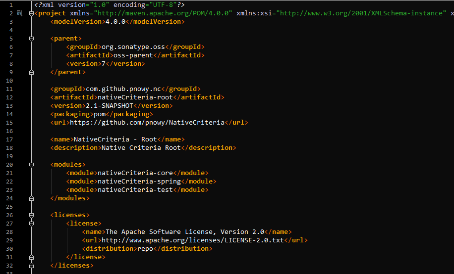
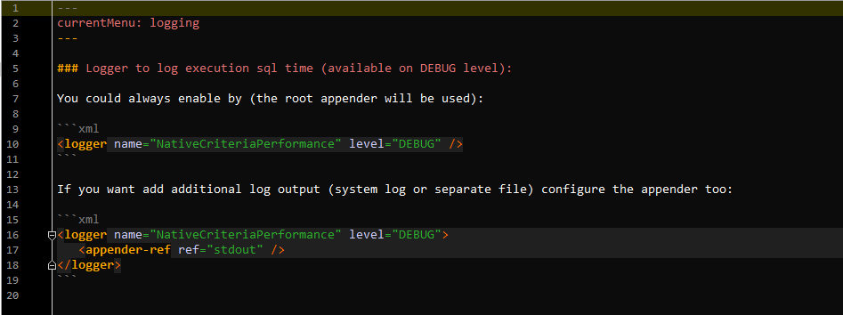

# My Intellij IDEA color theme

## Archived

This repo is archived. If you are looking up-to-date Intellij version and VS Code of this color theme you will find it here: https://github.com/pnowy/fulgora

## Color scheme

The scheme was built based on Vibrant color scheme and modified by time in order to adjust my requirements.

Example screenshots for Java, XML and MD:

### Java

### XML

### Markdown

